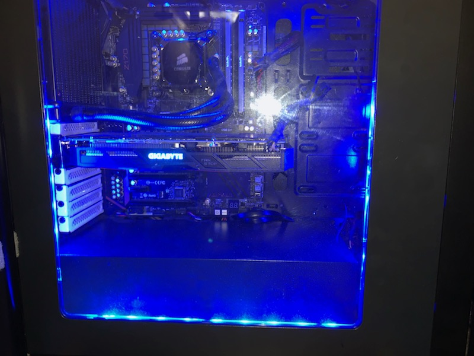
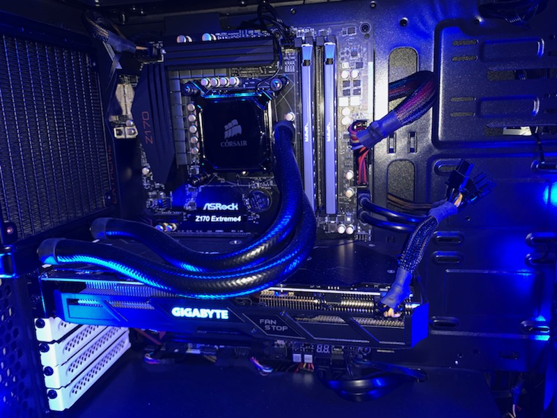
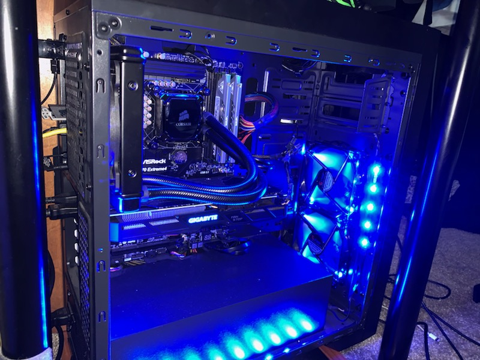

# IT2600 Final Project How to build a computer
Created by *Dylan Barrett*
Description: An in depth guide of building a computer and the sub-parts that go into it.
Purpose: Give a clear understanding of the process of building a computer and what each component does.
Target Audience: Anyone who is in the process of looking to build a computer.
___

## Budget
The first step when considering buying or building a computer is how much you are willing to spend on it. For most games today (2019) you can get by with a $500 computer. You also need to understand your own needs. Are you just going to be doing daily task like checking your email or surfing the web? If so then you can stay at or below the $500 budget, but if you want to do more intense task like playing games, streaming, or video/photo editing and processing then you will need to reconsider you budget closer to $1000 or so.
___

## Choosing Parts
After you pick your budget then you can move onto actually picking out the parts you want, but where do you start? There are places like [pcpartpicker.com](https://pcpartpicker.com/) and others that allow to pick out parts and show you which peices are compatible with each other. 
___

## Components you will need
* [1. Processor (CPU)](#processor)
* [2. Motherboard (MOBO)](#motherboard)
* [3. Graphics Card (GPU)](#graphics)
* [4. Memory (RAM)](#memory)
* [5. Cooling](#cooling)
* [6. Storage (SSD or HDD)](#storage)
* [7. Power Supply Unit (PSU)](#power)
* [8. Case](#case)
___
## Processor
The processor or Central Processing Unit, is essentially the brain of your computer. There are generally two paths when it comes to cpus. You can either choose Intel which is known for thier stronger single-core performences, making them better for gaming. While AMD processors are known for thier stronger mulit-core performance, making them better for multitasking.
___
## Motherboard
Now that you have picked out your cpu its time to pick out the motherboard. Depending on what kind of CPU you chose you will need a certain kind of motherboard that is compatible with your chipset of the cpu. You can also choose how big you want your motherboard to be with sizes being from smalles to largest (FlexATX, microATX, Mini ATX, ATX, Extended ATX and WTX). You will also need to decide if you want to overclock your cpu, if you do then you will need to spend a little more on a motherboard as lower-end MOBOs don't allow for overclocking. Depending on the size of MOBO you want will determine how much RAM, PCI slots and connections you will have. General trusted and reliable MOBO brands are Gigabyte,ASUS, MSI, EVGA and ASRock.
___
## Graphics
The Graphics processing unit or GPU will the be the component that impacts your gaming performance the most. You don't want to cheapout on a graphics card or cpu as these componenets rely on each other to give your computer the best performance it can have. A general rule of thumb in the commmunity is to **NOT** spend less than *half* of your GPU budget on your cpu. Meaning if you budgeted $300 for your gpu then you should spend at least $150 on your cpu. This will help ensure that you are avoiding throttling or bottlenecking, which affects your overall performance of your computer.  Depending on what you are doing with your computer depends on how much Video RAM or VRAM you will need. For reference at a 6GB or higher you should expect good performance in VR titles, 4K titles and 1440p titles with high-definition textures.
___
## Memory
RAM or Random Access Memory is the 3rd most important component for gaming and multitasking performance. It is tied directly to your CPU's performance. You can run RAM in single, dual or quad channel which all affect your CPU speed. As of now (2019) we are on DDR4 memory with DDR5 expected to become mainstream in 2021 or so. What matters the most when it comes to RAM is quanity and speed. The more RAM you have the better off your system will be at managing multiple applications at the same time. 

-For now **4GB** or ram is the absolute minimum your system should have. 
-**8GB** or ram is ok for light gaming and multitasking on cutting-edge titles.
-**16GB** is great at least for now before games start requiring this amount from your system. This is generally where you want to start when it comes to video editing/processing and productivity work
-**32GB** You are just showing off
___
## Cooling
For cooling you can choose a couple different options. When purchasing your CPU it comes with a stock air cooler included, you can choose to use this is you want to. If not, then there are 2 other options AIO Coolers which help lower the operating temps of your CPU to make it more effiecent than the stock cooler. Or you can do a custom water cooled loop, which requires a reservoir, water blocks and acrylic tubing. Depending on how hot you think your system is going to be running will determine which one you will need. Generally the stock cooler or an AIO cooler will be plenty for most users, while water cooled system are for heavy usage or just people that want to have a cool looking computer.
___
## Storage
You have two options here Solid state Drive (ssd) or Hard disk Drive (hdd). 
-If you want quality and speed go for a ssd as these are more durabe and smaller and size
-If you want quanity then pick up a hdd.

I would recommend getting both if you can afford it. Getting an ssd that is a couple hundred of gigabytes will hold you operating system, programs, and your favorite games. Doing this will improve boot times on your programs and the startup time (from off to home screen) this will make your system feel way more responsive. While your HDD would be used to store media and the rest of the games where loading times aren't an issue (single player games).
___
## Power
Getting a PSU is pretty straightforward you just need to follow a couple rules.
1. Buy from reputable dealers (ie. Corsair, EVGA, Seasonic just to name a few)
2. Make sure your get a power supply that will have enough wattage for your system.
3. Purchase PSUs with 80+ ratings, this is refering to the effiency of the unit.
___
## Case
For your case you will want to pick one that matches your motherboard size. You also need to make sure your case has room for your graphics card and water cooling if you wish to do so. There are also other features that you will want to consider like if it has enough usb3 headers and adequate cooling (fan setup for basic airflow throught the system).
___
## Building your PC
First you will want to make sure that you are **NOT** wearing anything that could create static energy and discharge as this will destroy your components. Then take your cpu and set it in the MOBO's cpu socket gentally (make sure you dont bend any of the pins). Next you can install your RAM sticks depending on how many purchased will determine if you are going to have single,dual, or quad channel RAM. Then you can install your stock cooler on top of the cpu and secure it with the four screws provided. Next you will want to open up your case and install your IO shield from the motherboard then, carefully set your MOBO and the other componenets down into the case on top of the screw studs in the case, then secure the MOBO to the case with the provided screws. Next you can take your graphics card and insert it into the PCI port on the board and secure it down with the screws. Then grab your storage and secure them inside the case somewhere (some cases have dedicated spots for these). Lastly take your power supply and install at the bottom of your case and connect the cables to thier respective ports(see your motherboard instructions or your power supply instructions to confirm ports). Then you can use zip ties to tidy up your cables and make everything look good. Then put your case door back on and you are done. 
___
#### If this was confusing which i am sure it was then checkout the videos below for more information on parts and the building process
[How to build a PC! step-by-step](https://www.youtube.com/watch?v=IhX0fOUYd8Q)

[Building a gaming PC](https://www.youtube.com/watch?v=hGiAfMoYEjI)

[$1000 gaming pc build guide](https://www.youtube.com/watch?v=fkHNgGaYR0I)

### Here are a few pics of my PC which cost me around $1000 at the time.
[here is a link to the components in my build](https://pcpartpicker.com/list/)

